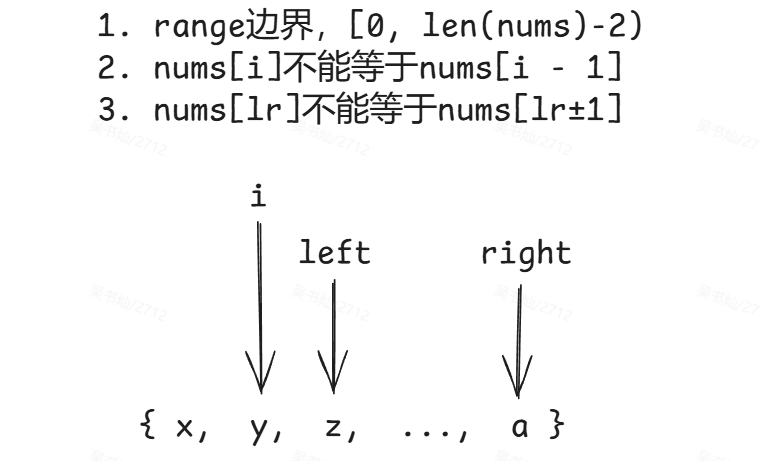
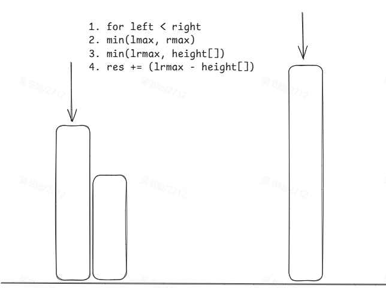
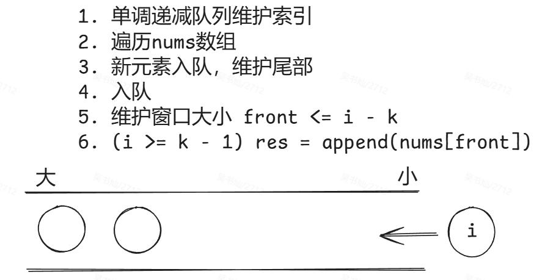
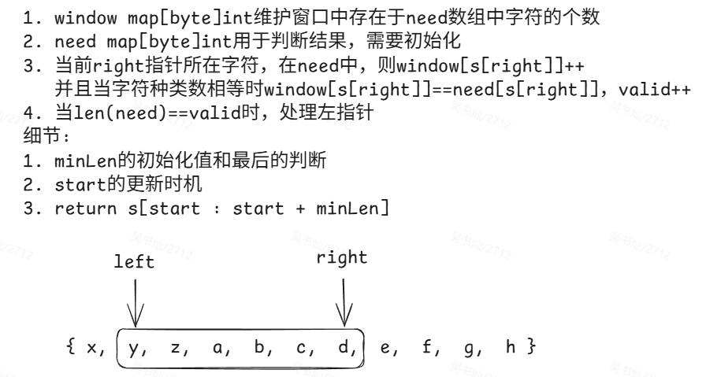

# 总览

## 混淆题型

```
最长连续序列、无重复字符的最长子串
找到字符串中所有字母异位词、最小覆盖子串
和为K的子数组、最大数组和
```

# 哈希

## 1. 两数之和

先查找，后存值，防止重复匹配

## 49. 字母异位词分组

思路：将strs中的字符串字典排序存入mp中，然后遍历mp即可得到答案

```go
mp := make(map[string][]string)

func sortedKey(s string) string {
    c := byte(s)
    sort.Slice(c, func(i, j int) bool {
        return c[i] < c[j]
    })
    return string(c)
}
```

## ***128. 最长连续序列

思路：将nums存入map中，再遍历map

细节：**遍历map，防止遍历重复数字**

```go
1. 遍历map
2. 当前做起点的值x，如果x-1在map则continue
3. 寻找x为起点的终点y
4. res = max(res, y - x)
```

# 双指针

## 283. 移动零

```go
1. 遍历nums
2. if num != 0 {nums[zeroCnt] = num; zeroCnt ++}
```

## 11. 盛最多水的容器

思路：移动更短的指针计算area

细节：**需要注意计算area时的宽**

## ***15. 三数之和

思路：三重循环，将内两重改为双指针

细节：

1. 需要将数组**排序**
2. nums[i] == nums[i - 1]时需要continue，**防止数字重复**
3. **双指针的初始位置**，以及**指针什么时候移动**
4. **防止双指针移动后指到的数字重复**，因为这里有数组有序的特性



## 42. 接雨水

思路：lmax和rmax

细节：**注意是先进行指针的移动，再进行内层的ifelse判断**



# 滑动窗口

## 3. 无重复字符的最长子串

思路：用right命名遍历字符串s，有重复则移动左窗口边界

细节：`window := make(map[rune]bool, len(s))`

## 438. 找到字符串中所有字母异位词

思路：scount := [26]int{}

细节：

# 子串

## 560. 和为 K 的子数组

思路：前缀和，以及使用map[int]int辅助

细节：前缀和的下标，`res += cnt[sj - k]`和cnt++的顺序

## 239. 滑动窗口最大值

思路：双端队列

```
1. for nums[i] >= 队尾元素，remove
2. for 队头元素 <= i - k，remove
3. 如果i >= k - 1，res = append
```

细节：

1. `dequeue.Len() > 0`
2. 三个条件的等于符号选择，全部都带有等号
3. `dequeue.PushBack(i)`的位置
4. `dequeue.Back().Value.(int)`和`dequeue.Remove(dequeue.Back())`



## *********76. 最小覆盖子串

思路：need map[byte]int辅助判断，left和right维护窗口大小

细节：

1. 维护窗口写法

```go
        if _, ok := need[s[right]]; ok {
            window[s[right]] ++
            if need[s[right]] == window[s[right]] {
                valid ++
            }
        }
		right ++
```

2. 处理左指针的for循环



# 普通数组

## ***53. 最大子数组和

思路：前缀和-最小前缀和

细节：维护最小前缀和

## 56. 合并区间

思路：排序后合并

细节：排序的写法，合并的几种情况**（用end判断即可）**

排序写法：

```go
    sort.Slice(intervals, func(i, j int) bool {
        return intervals[i][0] < intervals[j][0]
    })
```

合并直接用res计算：

```go
    res = append(res, intervals[0])
    for i := 1; i < n; i ++ {
        // 有交集
        if intervals[i][0] <= res[len(res) - 1][1] && intervals[i][1] >= res[len(res) - 1][1]{
            res[len(res) - 1][1] = intervals[i][1]
        }
        // 不包含
        if intervals[i][0] > res[len(res) - 1][1] {
            res = append(res, intervals[i])
        }
    }
```

## 189. 轮转数组

思路：三次reverse

细节：**k取模**

reverse写法：

```go
    for start < end {
        nums[start], nums[end] = nums[end], nums[start]
        start++
        end--
    }
```

## 238. 除自身以外数组的乘积

思路：前缀乘和后缀乘

细节：公式

```go
preMul[i] = preMul[i - 1] * nums[i - 1]
sufMul[i] = sufMul[i + 1] * nums[i + 1]
```

## 41. 缺失的第一个正数

思路：两次遍历，第一次遍历将数字归位，第二次判断结果

细节：

1. 第一次归位时，归位要用for循环（**需要持续交换，直到当前位置的数无法归位为止**）
2. 归位for循环的nums[i]条件
3. return n + 1

# 矩阵

## 73. 矩阵置零

思路：记录第一行和第一列辅助判断

```
1. 记录第一行和第一列是否有零值
2. 遍历整个数组，有零值的那一行和那一列的边缘记上零
3. 根据[0][j]和[j][0]进行赋值
4. 根据是否有零值置第一行和第一列为零
```

细节：第3步是从索引1开始的（**避免干扰首行首列作为“标记位”的作用**）

## ***54. 螺旋矩阵

思路：top, bottom, left, right

细节：top <= bottom && left <= right

```go
        if top <= bottom {
            for i := right; i >= left; i -- {
                res = append(res, matrix[bottom][i])
            }
            bottom --
        }
```

## ***48. 旋转图像

思路：转置矩阵，翻转每一行

```go
	for i := 0; i < n; i++ {
		for j := 0; j < i; j++ {
			matrix[i][j], matrix[j][i] = matrix[j][i], matrix[i][j]
		}
	}

	for i := 0; i < n; i++ {
		for j := 0; j < n/2; j++ {
			matrix[i][j], matrix[i][n-1-j] = matrix[i][n-1-j], matrix[i][j]
		}
	}
```

